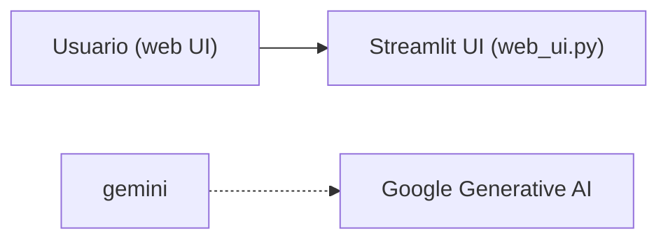

# 📦 Helm Inventory LLM (con Gemini)

Este proyecto permite consultar el inventario de componentes desplegados vía Helm en un clúster EKS de AWS, interactuando con un modelo LLM (Gemini) para realizar preguntas en lenguaje natural sobre el estado de la infraestructura.

---

## 🖼️ Diagrama de arquitectura



---

## 🚀 Funcionalidades

- Inventario completo de releases Helm por clúster
- Selección de clúster EKS desde interfaz
- Cambio automático de contexto `kubectl` con perfil AWS
- Validación de conexión al clúster
- Revisión de versiones instaladas de `kubectl`, `helm`, `aws-cli`
- Comparación con últimas versiones disponibles (GitHub)
- Consulta de versiones de nodos y del clúster
- Preguntas en lenguaje natural usando Gemini
- Exportación de recomendaciones a CSV y PDF
- Historial de preguntas y respuestas
- Interfaz web vía `Streamlit`

---

## 📂 Estructura del proyecto

```
.
├── app/
│   ├── inventory.py         # Obtención del inventario de Helm
│   ├── llm_gemini.py        # Integración con modelo Gemini
│   ├── tools_info.py        # Utilidades: versiones, validaciones
│   ├── chart_versions.py    # Funciones utilitarias para versiones y PDF (sin Streamlit)
│   └── web_ui.py            # Interfaz principal Streamlit (único archivo con UI)
├── .env                     # Configuración de entorno
├── requirements.txt
└── README.md
```

> **Nota:** Solo `web_ui.py` contiene la interfaz Streamlit. El resto de archivos son utilidades y lógica.

---

## 🧪 Requisitos

- Python 3.10+
- Acceso a AWS CLI y EKS
- Clave de API de Google Generative AI (Gemini)
- `kubectl` y `helm` instalados

---

## 🚦 Guía rápida de ejecución

1. **Clona el repositorio:**
   ```bash
   git clone <repo-url>
   cd <repo>
   ```
2. **Crea el archivo `.env`** con tus credenciales y configuración:
   ```env
   # Ejemplo en .env
   GEMINI_API_KEY=...
   MCP_SERVER_URL=http://localhost:8000/mcp
   OPENAI_API_KEY=...
   OPENAI_MODEL=gpt-3.5-turbo
   EKS_CLUSTERS_JSON={...}
   EKS_PROFILES_JSON={...}
   ```
3. **Instala las dependencias:**
   ```bash
   pip install -r requirements.txt
   ```
4. **Ejecuta la aplicación web:**
   ```bash
   PYTHONPATH=. streamlit run app/web_ui.py
   ```
5. **Accede a la interfaz:**
   Abre tu navegador en [http://localhost:8501](http://localhost:8501)

---

## 💬 Ejemplos de preguntas

- ¿Qué versión tiene Prometheus?
- ¿Está Loki desplegado?
- ¿Qué componentes están desactualizados?
- ¿Qué versión tiene metrics-server?

---

## 📤 Exportar recomendaciones

En la pestaña de recomendaciones puedes exportar los resultados a CSV o PDF usando los botones de descarga.

---

## 📌 Notas técnicas

- El clúster seleccionado cambia automáticamente el contexto de kubectl usando AWS CLI.
- La validación de acceso se hace con `kubectl get nodes`.
- Gemini se consulta vía `google-generativeai` y el modelo `gemini-1.5-pro-latest`.
- El archivo `chart_versions.py` solo contiene funciones utilitarias, no debe tener UI de Streamlit.

---

## 🔒 Seguridad

No se guarda información sensible. Los perfiles de AWS y claves deben manejarse mediante `.env`.

---

## 📥 Futuras mejoras

- Soporte para modelos locales (Ollama)
- Mejoras en la exportación y visualización de reportes

