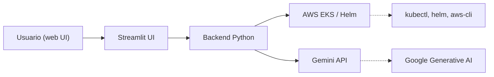

# 📦 Helm Inventory LLM (con Gemini)

Este proyecto permite consultar el inventario de componentes desplegados vía Helm en un clúster EKS de AWS, interactuando con un modelo LLM (Gemini) para realizar preguntas en lenguaje natural sobre el estado de la infraestructura.

---

## 🖼️ Diagrama de arquitectura



---

## 🚀 Funcionalidades

- Inventario completo de releases Helm por clúster
- Selección de clúster EKS desde interfaz
- Cambio automático de contexto `kubectl` con perfil AWS
- Validación de conexión al clúster
- Revisión de versiones instaladas de `kubectl`, `helm`, `aws-cli`
- Comparación con últimas versiones disponibles (GitHub)
- Consulta de versiones de nodos y del clúster
- Preguntas en lenguaje natural usando Gemini
- Historial de preguntas y respuestas
- Interfaz web vía `Streamlit`

---

## 📂 Estructura del proyecto

```
.
├── app/
│   ├── inventory.py         # Obtención del inventario de Helm
│   ├── llm_gemini.py        # Integración con modelo Gemini
│   ├── tools_info.py        # Utilidades: versiones, validaciones
│   └── web_ui.py            # Interfaz Streamlit
├── .env                     # Configuración de entorno
├── requirements.txt
└── README.md
```

---

## 🧪 Requisitos

- Python 3.10+
- Acceso a AWS CLI y EKS
- Clave de API de Google Generative AI (Gemini)
- `kubectl` y `helm` instalados

---

## 🚦 Guía rápida de ejecución

1. **Clona el repositorio:**
   ```bash
   git clone https://github.com/tu-org/helm-llm-inventory-gemini.git
   cd helm-llm-inventory-gemini
   ```
2. **Crea el archivo `.env`** con tus credenciales y configuración:
   ```env
   GEMINI_API_KEY=tu_api_key_google
   EKS_CLUSTERS_JSON={
     "nexus-dev1-eks-cluster":"eu-west-1"
   }
   EKS_PROFILES_JSON={
     "nexus-dev1-eks-cluster":"EKSDeploymentExecution_dev1"
   }
   ```
3. **Instala las dependencias:**
   ```bash
   pip install -r requirements.txt
   ```
4. **Ejecuta la aplicación web:**
   ```bash
   streamlit run app/web_ui.py
   ```
5. **Accede a la interfaz:**
   Abre tu navegador en [http://localhost:8501](http://localhost:8501)

---

## 💬 Ejemplos de preguntas

- ¿Qué versión tiene Prometheus?
- ¿Está Loki desplegado?
- ¿Qué componentes están desactualizados?
- ¿Qué versión tiene metrics-server?

---

## 📌 Notas técnicas

- El clúster seleccionado cambia automáticamente el contexto de kubectl usando:
  ```bash
  aws eks --region <region> update-kubeconfig --name <cluster> --profile <perfil>
  ```
- La validación de acceso se hace con:
  ```bash
  kubectl get nodes
  ```
- Gemini se consulta vía `google-generativeai` y el modelo `gemini-1.5-pro-latest`.

---

## 🔒 Seguridad

No se guarda información sensible. Los perfiles de AWS y claves deben manejarse mediante `.env`.

---

## 📥 Futuras mejoras

- Soporte para modelos locales (Ollama)
- Exportación de respuestas en PDF
- Comparación entre clústeres
- Integración con CI/CD

---

## 🧠 Créditos

Desarrollado por [Tu Nombre / Tu Equipo]  
Con ayuda de Gemini, Streamlit y mucho ☕️

